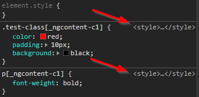
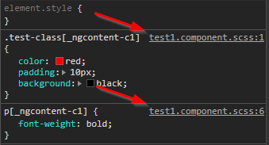

# webpack-angular-source-map
Webpack loader for Angular which allows debugging of source files by automatically adding sourceURL.
Especially useful for SASS and LESS.

## Why?
When working with Angular 5+ (and potentially some previous versions as well), the complied sass, scss and less files are displayed as inline style.
When debugging, it consumes a lot of time to trace back the source file.

This loader automatically adds /\*# sourceURL=[FILENAME] \*/ to the relevant files, and thus showing the file names when debugging.

Before:



After:



## How to use
In the relevant loaders section, add this loader *after*  the "raw-loader".
Example:
```
{
  ...
  "test": /\.scss$|\.sass$/,
  "use": [
    {
      "loader": "raw-loader"
    },
    {
      "loader": "webpack-angular-source-map"
    },
    ...
  ]
}
```
